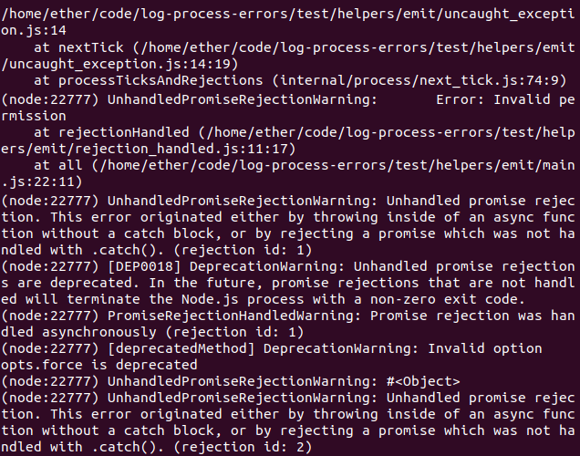
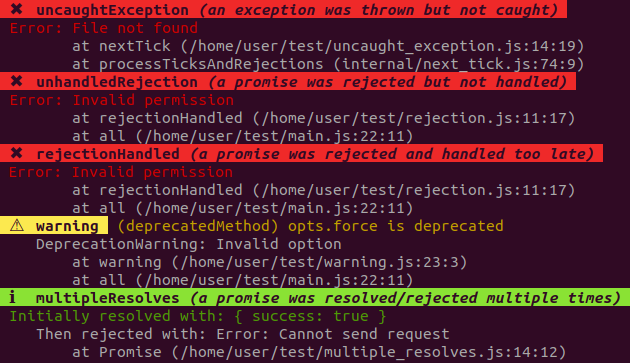

[](https://codecov.io/gh/ehmicky/log-process-errors)
[](https://travis-ci.org/ehmicky/log-process-errors)
[](https://www.npmjs.com/package/log-process-errors)
[](https://gitter.im/ehmicky/log-process-errors)
[](https://twitter.com/intent/follow?screen_name=ehmicky)
[](https://medium.com/@ehmicky)

[📰 Medium article.](https://medium.com/@ehmicky/node-js-process-errors-are-broken-193980f0a77b)

Show some ❤️ to Node.js process errors.

Node.js prints process errors
([`uncaughtException`](https://nodejs.org/api/process.html#process_event_uncaughtexception),
[`warning`](https://nodejs.org/api/process.html#process_event_warning),
[`unhandledRejection`](https://nodejs.org/api/process.html#process_event_unhandledrejection),
[`rejectionHandled`](https://nodejs.org/api/process.html#process_event_rejectionhandled))
on the console which is very useful. Unfortunately those errors:

- do not show stack traces for
  [`warning`](https://nodejs.org/api/process.html#process_event_warning) and
  [`rejectionHandled`](https://nodejs.org/api/process.html#process_event_rejectionhandled)
  making them hard to debug.
- do not include
  [`multipleResolves`](https://nodejs.org/api/process.html#process_event_multipleresolves)
  errors (when a promise is resolved/rejected twice).
- are inconvenient to [log to an external service](docs/API.md#log).
- are hard to [test](docs/API.md#testing).
- cannot be conditionally skipped.
- are printed each time an error is repeated (except for
  [`warning`](https://nodejs.org/api/process.html#process_event_warning)).
- are not human-friendly.

`log-process-errors` fixes all those issues.

Without `log-process-errors`:



With `log-process-errors`:



# Use cases

- Proper **logging** of process errors in production.
- **Debugging** of process errors in development.
- Automated **testing** of process errors.

# Demo

You can try this library:

- either directly
  [in your browser](https://repl.it/@ehmicky/log-process-errors).
- or by executing the [`examples` files](examples/README.md) in a terminal.

# Install

Production code (e.g. a server) can install this either as a production or
development dependency:

```bash
npm install log-process-errors
```

However, libraries should install this as a development dependency:

```bash
npm install -D log-process-errors
```

This is because logging is modified globally and libraries users might not
expect this side-effect. Also, this might lead to conflicts between libraries.

# Usage

There are two ways to load this library. The first is to use the
[`node -r` CLI flag](https://nodejs.org/api/cli.html#cli_r_require_module):

```bash
node -r log-process-errors/build/register ...
```

The second is:

```js
const logProcessErrors = require('log-process-errors')
logProcessErrors(options)
```

`logProcessErrors()` should be called as early as possible in the code, before
other `require`/`import` statements.

# Options

`options` is an optional object with the following properties.

## log

_Type_: `function(error, level, originalError)`<br>

Customizes how process errors are logged.<br>
[Full documentation](docs/API.md#log).

## level

_Type_: `object`<br> _Default_:
`{ warning: 'warn', multipleResolves: 'info', default: 'error' }`

Which log level to use.<br> [Full documentation](docs/API.md#level).

## exitOn

_Type_: `string[]`<br> _Default_: `['uncaughtException']`

Which process errors should trigger `process.exit(1)`.<br>
[Full documentation](docs/API.md#exiton).

## testing

_Type_: `string`<br> _Value_: `'ava'`, `'mocha'`, `'jasmine'`, `'tape'` or
`'node-tap'`<br> _Default_: `undefined`

When running tests, makes them fail if there are any process errors.<br>
[Full documentation](docs/API.md#testing).

## colors

_Type_: `boolean`<br> _Default_: `true` if the output is a terminal.

Colorizes messages.<br> [Full documentation](docs/API.md#colors).

# Support

If you found a bug or would like a new feature, _don't hesitate_ to
[submit an issue on GitHub](../../issues).

For other questions, feel free to
[chat with us on Gitter](https://gitter.im/ehmicky/log-process-errors).

Everyone is welcome regardless of personal background. We enforce a
[Code of conduct](CODE_OF_CONDUCT.md) in order to promote a positive and
inclusive environment.

# Contributing

This project was made with ❤️. The simplest way to give back is by starring and
sharing it online.

If the documentation is unclear or has a typo, please click on the page's `Edit`
button (pencil icon) and suggest a correction.

If you would like to help us fix a bug or add a new feature, please check our
[guidelines](CONTRIBUTING.md). Pull requests are welcome!

Thanks go to our wonderful contributors:

<!-- ALL-CONTRIBUTORS-LIST:START -->
<!-- prettier-ignore -->
<table><tr><td align="center"><a href="https://twitter.com/ehmicky"><br /><sub><b>ehmicky</b></sub></a><br /><a href="https://github.com/ehmicky/log-process-errors/commits?author=ehmicky" title="Code">💻</a> <a href="#design-ehmicky" title="Design">🎨</a> <a href="#ideas-ehmicky" title="Ideas, Planning, & Feedback">🤔</a> <a href="https://github.com/ehmicky/log-process-errors/commits?author=ehmicky" title="Documentation">📖</a></td><td align="center"><a href="https://svachon.com"><br /><sub><b>Steven Vachon</b></sub></a><br /><a href="#question-stevenvachon" title="Answering Questions">💬</a></td><td align="center"><a href="https://github.com/Hongarc"><br /><sub><b>Hongarc</b></sub></a><br /><a href="https://github.com/ehmicky/log-process-errors/commits?author=Hongarc" title="Documentation">📖</a> <a href="https://github.com/ehmicky/log-process-errors/commits?author=Hongarc" title="Code">💻</a></td></tr></table>

<!-- ALL-CONTRIBUTORS-LIST:END -->
