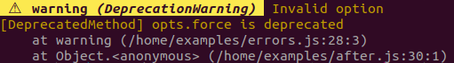
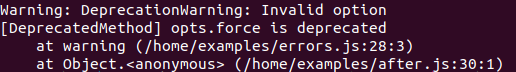

<picture>
  <source media="(prefers-color-scheme: dark)" srcset="https://raw.githubusercontent.com/ehmicky/design/main/log-process-errors/log-process-errors_dark.svg"/>
  
</picture>

[](https://codecov.io/gh/ehmicky/log-process-errors)
[](/src/main.d.ts)
[](https://www.npmjs.com/package/log-process-errors)
[](https://twitter.com/intent/follow?screen_name=ehmicky)
[](https://medium.com/@ehmicky)

[📰 Medium article.](https://medium.com/@ehmicky/node-js-process-errors-are-broken-193980f0a77b)

Show some ❤️ to Node.js process errors.

Node.js prints process errors
([`uncaughtException`](https://nodejs.org/api/process.html#process_event_uncaughtexception),
[`warning`](https://nodejs.org/api/process.html#process_event_warning),
[`unhandledRejection`](https://nodejs.org/api/process.html#process_event_unhandledrejection),
[`rejectionHandled`](https://nodejs.org/api/process.html#process_event_rejectionhandled))
on the console which is very useful. Unfortunately those errors:

- do not show stack traces for
  [`warning`](https://nodejs.org/api/process.html#process_event_warning) and
  [`rejectionHandled`](https://nodejs.org/api/process.html#process_event_rejectionhandled)
  making them hard to debug.
- are inconvenient to [log to an external service](#log).
- are hard to [test](#testing).
- cannot be conditionally skipped.
- are printed each time an error is repeated (except for
  [`warning`](https://nodejs.org/api/process.html#process_event_warning)).
- are not human-friendly.

`log-process-errors` fixes all those issues.

Without `log-process-errors`:


With `log-process-errors`:


# Use cases

- Proper **logging** of process errors in production.
- **Debugging** of process errors in development.
- Automated **testing** of process errors.

# Install

Production code (e.g. a server) can install this either as a production or
development dependency:

```bash
npm install log-process-errors
```

However, libraries should install this as a development dependency:

```bash
npm install -D log-process-errors
```

This is because logging is modified globally and libraries users might not
expect this side-effect. Also, this might lead to conflicts between libraries.

This package is an ES module and must be loaded using
[an `import` or `import()` statement](https://gist.github.com/sindresorhus/a39789f98801d908bbc7ff3ecc99d99c),
not `require()`.

# API

## logProcessErrors(options?)

[`options`](#options) `object?`\
_Return value_: `() => void`

Initializes `log-process-errors`. Should be called as early as possible in the
code, before other `import` statements.

```js
import logProcessErrors from 'log-process-errors'
logProcessErrors(options)
```

Returns a function that can be fired to restore Node.js default behavior.

```js
import logProcessErrors from 'log-process-errors'

const restore = logProcessErrors(options)
restore()
```

## Options

### log

_Type_: `function(error, level, originalError)`

By default process errors will be logged to the console using `console.error()`,
`console.warn()`, etc.

This behavior can be overridden with the `log` option. For example to log
process errors with [Winston](https://github.com/winstonjs/winston) instead:

```js
import logProcessErrors from 'log-process-errors'

logProcessErrors({
  log(error, level, originalError) {
    winstonLogger[level](error.stack)
  },
})
```

The function's arguments are [`error`](#error), [`level`](#level) and
[`originalError`](#error).

If logging is asynchronous, the function should return a promise (or use
`async`/`await`). This is not necessary if logging is buffered (like
[Winston](https://github.com/winstonjs/winston)).

Duplicate process errors are only logged once (whether the `log` option is
defined or not).

#### error

_Type_: `Error`

The [`log`](#log) and [`level`](#level) options receive as argument an `error`
instance.

This error is generated based on the original process error but with an improved
`name`, `message` and `stack`. However the original process error is still
available as a third argument to [`log`](#log).

##### error.name

_Type_: `string`\
_Value_: [`'UncaughtException'`](https://nodejs.org/api/process.html#process_event_uncaughtexception),
[`'UnhandledRejection'`](https://nodejs.org/api/process.html#process_event_unhandledrejection),
[`'RejectionHandled'`](https://nodejs.org/api/process.html#process_event_rejectionhandled)
or [`'Warning'`](https://nodejs.org/api/process.html#process_event_warning)

##### error.stack

`error` is prettified when using
[`console`](https://nodejs.org/api/console.html#console_console_log_data_args)
or
[`util.inspect()`](https://nodejs.org/api/util.html#util_util_inspect_object_options):

```js
console.log(error)
```



But not when using `error.stack` instead:

```js
console.log(error.stack)
```



### level

_Type_: `object`\
_Default_: `{ warning: 'warn', default: 'error' }`

Which log level to use.

Object keys are the error names:
[`uncaughtException`](https://nodejs.org/api/process.html#process_event_uncaughtexception),
[`warning`](https://nodejs.org/api/process.html#process_event_warning),
[`unhandledRejection`](https://nodejs.org/api/process.html#process_event_unhandledrejection),
[`rejectionHandled`](https://nodejs.org/api/process.html#process_event_rejectionhandled)
or `default`.

Object values are the log level: `'debug'`, `'info'`, `'warn'`, `'error'`,
`'silent'` or `'default'`. It can also be a function using
[`error` as argument](#error) and returning one of those log levels.

```js
import logProcessErrors from 'log-process-errors'

logProcessErrors({
  level: {
    // Use `debug` log level for `uncaughtException` instead of `error`
    uncaughtException: 'debug',

    // Skip some logs based on a condition
    default(error) {
      return shouldSkip(error) ? 'silent' : 'default'
    },
  },
})
```

### exitOn

_Type_: `string[]`\
_Value_: array of [`'uncaughtException'`](https://nodejs.org/api/process.html#process_event_uncaughtexception),
[`'unhandledRejection'`](https://nodejs.org/api/process.html#process_event_unhandledrejection),
[`'rejectionHandled'`](https://nodejs.org/api/process.html#process_event_rejectionhandled)
or [`'warning'`](https://nodejs.org/api/process.html#process_event_warning)\
_Default_: `['uncaughtException', 'unhandledRejection']` for Node `>= 15.0.0`,
`['uncaughtException']` otherwise.

Which process errors should trigger `process.exit(1)`:

- `['uncaughtException', 'unhandledRejection']` is Node.js default behavior
  since Node.js `15.0.0`. Before, only
  [`uncaughtException`](https://nodejs.org/api/process.html#process_warning_using_uncaughtexception_correctly)
  was enabled.
- use `[]` to prevent any `process.exit(1)`. Recommended if your process is
  long-running and does not automatically restart on exit.

`process.exit(1)` will only be fired after successfully logging the process
error.

```js
import logProcessErrors from 'log-process-errors'

logProcessErrors({ exitOn: ['uncaughtException', 'unhandledRejection'] })
```

### testing

_Type_: `string`\
_Value_: `'ava'`, `'mocha'`, `'jasmine'`, `'tape'` or `'node_tap'`\
_Default_: `undefined`

When running tests, makes them fail if there are any process errors.

Example with [Ava](https://github.com/avajs/ava):

<!-- eslint-disable import/order, import/first -->

```js
import logProcessErrors from 'log-process-errors'
// Should be initialized before requiring other dependencies
logProcessErrors({ testing: 'ava' })

import test from 'ava'

// Tests will fail because a warning is triggered
test('Example test', (t) => {
  process.emitWarning('Example warning')
  t.pass()
})
```

To ignore specific process errors, use the [`level` option](#level):

<!-- eslint-disable import/order, import/first -->

```js
import logProcessErrors from 'log-process-errors'
// Should be initialized before requiring other dependencies
logProcessErrors({ testing: 'ava', level: { warning: 'silent' } })

import test from 'ava'

// Tests will not fail because warnings are `silent`
test('Example test', (t) => {
  process.emitWarning('Example warning')
  t.pass()
})
```

## colors

_Type_: `boolean`\
_Default_: `true` if the output is a terminal.

Colorizes messages.

```js
import logProcessErrors from 'log-process-errors'

logProcessErrors({ colors: false })
```

# Related projects

- [`modern-errors`](https://github.com/ehmicky/modern-errors): Handle errors
  like it's 2022 🔮
- [`error-custom-class`](https://github.com/ehmicky/error-custom-class): Create
  one error class
- [`error-class-utils`](https://github.com/ehmicky/error-class-utils): Utilities
  to properly create error classes
- [`error-serializer`](https://github.com/ehmicky/error-serializer): Convert
  errors to/from plain objects
- [`normalize-exception`](https://github.com/ehmicky/normalize-exception):
  Normalize exceptions/errors
- [`merge-error-cause`](https://github.com/ehmicky/merge-error-cause): Merge an
  error with its `cause`
- [`set-error-class`](https://github.com/ehmicky/set-error-class): Properly
  update an error's class
- [`set-error-message`](https://github.com/ehmicky/set-error-message): Properly
  update an error's message
- [`set-error-props`](https://github.com/ehmicky/set-error-props): Properly
  update an error's properties
- [`error-cause-polyfill`](https://github.com/ehmicky/error-cause-polyfill):
  Polyfill `error.cause`
- [`handle-cli-error`](https://github.com/ehmicky/handle-cli-error): 💣 Error
  handler for CLI applications 💥

# Support

For any question, _don't hesitate_ to [submit an issue on GitHub](../../issues).

Everyone is welcome regardless of personal background. We enforce a
[Code of conduct](CODE_OF_CONDUCT.md) in order to promote a positive and
inclusive environment.

# Contributing

This project was made with ❤️. The simplest way to give back is by starring and
sharing it online.

If the documentation is unclear or has a typo, please click on the page's `Edit`
button (pencil icon) and suggest a correction.

If you would like to help us fix a bug or add a new feature, please check our
[guidelines](CONTRIBUTING.md). Pull requests are welcome!

Thanks go to our wonderful contributors:

<!-- ALL-CONTRIBUTORS-LIST:START -->
<!-- prettier-ignore-start -->
<!-- markdownlint-disable -->
<table>
  <tr>
    <td align="center"><a href="https://twitter.com/ehmicky"><br /><sub><b>ehmicky</b></sub></a><br /><a href="https://github.com/ehmicky/log-process-errors/commits?author=ehmicky" title="Code">💻</a> <a href="#design-ehmicky" title="Design">🎨</a> <a href="#ideas-ehmicky" title="Ideas, Planning, & Feedback">🤔</a> <a href="https://github.com/ehmicky/log-process-errors/commits?author=ehmicky" title="Documentation">📖</a></td>
    <td align="center"><a href="https://svachon.com"><br /><sub><b>Steven Vachon</b></sub></a><br /><a href="#question-stevenvachon" title="Answering Questions">💬</a></td>
    <td align="center"><a href="https://github.com/Hongarc"><br /><sub><b>Hongarc</b></sub></a><br /><a href="https://github.com/ehmicky/log-process-errors/commits?author=Hongarc" title="Documentation">📖</a> <a href="https://github.com/ehmicky/log-process-errors/commits?author=Hongarc" title="Code">💻</a></td>
    <td align="center"><a href="https://github.com/abrenneke"><br /><sub><b>Andy Brenneke</b></sub></a><br /><a href="https://github.com/ehmicky/log-process-errors/issues?q=author%3Aabrenneke" title="Bug reports">🐛</a></td>
  </tr>
</table>

<!-- markdownlint-enable -->
<!-- prettier-ignore-end -->

<!-- ALL-CONTRIBUTORS-LIST:END -->
