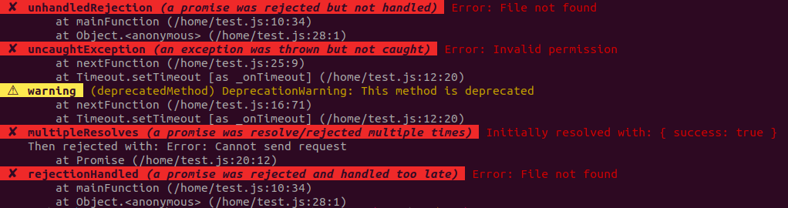

[](https://www.npmjs.com/package/log-process-errors) [](https://github.com/autoserver-org/log-process-errors/graphs/contributors) [](https://www.apache.org/licenses/LICENSE-2.0) [](https://www.npmjs.com/package/log-process-errors) [](#) [](https://standardjs.com) [](https://github.com/autoserver-org/eslint-config-standard-prettier-fp)

Log all process errors on the console (or using a custom logger):

- [`uncaughtException`](https://nodejs.org/api/process.html#process_event_uncaughtexception): an exception was thrown and not caught
- [`unhandledRejection`](https://nodejs.org/api/process.html#process_event_unhandledrejection): a promise was rejected and not handled
- [`rejectionHandled`](https://nodejs.org/api/process.html#process_event_rejectionhandled): a promise was rejected and handled too late
- [`multipleResolves`](https://nodejs.org/api/process.html#process_event_multipleresolves): a promise was resolved/rejected multiple times
- [`warning`](https://nodejs.org/api/process.html#process_event_warning): a warning was produced using [`process.emitWarning()`](https://nodejs.org/api/process.html#process_process_emitwarning_warning_options)



# Usage

<!-- eslint-disable no-unused-vars, node/no-missing-require,
import/no-unresolved, unicorn/filename-case, strict -->

```js
const logProcessErrors = require('log-process-errors')

logProcessErrors()
```

# Custom logging

By default events will be logged to the console (e.g. `console.error()`).

This default behavior can be overriden with the `log` option. For example
to log events with [Winston](https://github.com/winstonjs/winston) instead:

<!-- eslint-disable no-empty-function, no-unused-vars, node/no-missing-require,
import/no-unresolved, unicorn/filename-case, strict, no-undef -->

```js
logProcessErrors({
  log(message, level, info) {
    winstonLogger[level](message)
  },
})
```

The function's arguments are:

- `message` `{string}`: nice and detailed description of the event
- `level` `{string}`: log level
- `info` `{object}`:
  - information about the event:
    - `eventName` `{string}`: can be `uncaughtException`, `unhandledRejection`,
      `rejectionHandled`, `multipleResolves` or `warning`
    - `error` `{any}`:
      - either the value thrown by `uncaughtException`. Usually an `Error`
        instance, but not always.
      - or the error emitted by `warning`.
        [`error.code` and `error.detail`](https://nodejs.org/api/process.html#process_event_warning)
        might be defined. Always an `Error` instance.
    - `promiseState` `{string}`: whether promise was `resolved` or `rejected`.
    - `promiseValue` `{any}`: value resolved/rejected by the promise.
    - `secondPromiseState`, `secondPromiseValue`: like `promiseState` and
      `promiseValue` but for the second time the promise was resolved/rejected.
  - whether the properties above are defined or not depends on the event name:
    - `eventName`: always present
    - `error`: only on `uncaughtException` and `warning`
    - `promiseState`, `promiseValue`: only on `unhandledRejection`,
      `rejectionHandled` and `multipleResolves`
    - `secondPromiseState`, `secondPromiseValue`: only on `multipleResolves`

# Exiting on uncaught exceptions

By default `uncaughtException` will fire `process.exit(1)`. This is the
recommended behavior according to the
[Node.js documentation](https://nodejs.org/api/process.html#process_warning_using_uncaughtexception_correctly).

This can disabled by setting the `exitOnExceptions` option to `false`:

<!-- eslint-disable no-empty-function, no-unused-vars, node/no-missing-require,
import/no-unresolved, unicorn/filename-case, strict, no-undef -->

```js
logProcessErrors({ exitOnExceptions: false })
```

# Log level

By default the log level will be `warn` for `warning` events and `error` for
the other events.

This can be overriden by using the `getLevel` option. It should be a function
function using [`info` as argument](#custom-logging) and returning a string
among `error`, `warn`, `info` or `debug`.

# Log message

A nice-looking and descriptive log message is generated by default.

The message will be colorized unless either:

- the output [does not support colors](https://github.com/chalk/supports-color)
- the option `colors` is set to `false`

The message generation can be overriden by using the `getMessage` option. It
should be a function function using [`info` as argument](#custom-logging) and
returning a string. The `info` argument also has the following properties:

- `level` `{string}`
- `colors` `{object}`: [Chalk instance](https://github.com/chalk/chalk#api)
  to colorize strings. Colors will be disabled if the `colors` option is
  false.

# Filtering

Some events can be ignored by using the `filter` option. It should be a
function using [`info` as argument](#custom-logging) and returning a boolean
(`false` to ignore the event).

For example to ignore `warning` events:

<!-- eslint-disable no-empty-function, no-unused-vars, node/no-missing-require,
import/no-unresolved, unicorn/filename-case, strict, no-undef -->

```js
logProcessErrors({ filter: ({ eventName }) => eventName !== 'warning' })
```

# Stop logging

Logging can be stopped by firing the function returned by `logProcessErrors()`

<!-- eslint-disable no-empty-function, no-unused-vars, node/no-missing-require,
import/no-unresolved, unicorn/filename-case, strict, no-undef -->

```js
const stopLogging = logProcessErrors()
stopLogging()
```
